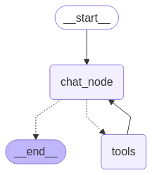

# Proyecto: Agente IA para recomedar proveedores y servicios

Este proyecto es una aplicacion de agentes de inteligencia artificial que permita gestionar información de empresas proveedoras de servicios, realizar sugerencias personalizadas y generar cotizaciones para eventos empresariales. A continuación, se explica cómo configurar el entorno de desarrollo y cómo instalar las dependencias necesarias.

## Requisitos previos

Antes de comenzar, asegúrate de tener instalados los siguientes programas en tu máquina:

- [Python 3.11.11](https://www.python.org/downloads/)
- [pip](https://pip.pypa.io/en/stable/installation/) (gestor de paquetes de Python)

## Configuración del entorno

### Paso 1: Crear un entorno virtual

1. Abre una terminal (o línea de comandos).
2. Navega al directorio donde se encuentra el proyecto.
3. Crea un entorno virtual ejecutando el siguiente comando:

   - En **Windows**:

     ```bash
     python -m venv env
     ```

   - En **Linux/macOS**:

     ```bash
     python3 -m venv env
     ```

   Esto creará un directorio llamado `env` que contiene el entorno virtual.

### Paso 2: Activar el entorno virtual

#### En **Windows**:

```bash
.\env\Scripts\activate
```
#### En **Linux/macOS**:
```bash
source env/bin/activate
```
### Paso 3: Instalar depedencias
 ```bash
pip install -r requirements.txt
```

## Ejecutar el proyecto

Ir a la carpeta razi del proyecto donde se encuentra y ejecutar:
 ```bash
python .\src\Main.py
```
Esto activara el endpoint del chat el cual podras usar desde index.html

## Estructura del proyecto

### Descripción de carpetas y archivos

- `data/`: Contiene la base de datos de los proveedores en formato .json .
- `src/`: Carpeta con el código principal de la aplicación.
  - `config/`: Contiene configuraciones del proyecto.
  - `controller/`: Contiene los endpoints del proyecto para acceder al servicio del chat.
  - `model/`: Contiene los modelos del proyecto.
  - `repository/`: Contiene el acceso a la base de datos.
  - `services/`: Contiene toda la logica del proyecto
  - `Main.py`: Punto de entrada para ejecutar la aplicación.
- `.env`: Archivo de variables de entorno **(SE DEBE CREAR)**
- `graph.png`: Imagen del grafo del agente
- `index.html`: Interfaz grafica para probar el chat.
- `README.md`: Documentación general del proyecto.
- `requirements.txt`: Archivo con las dependencias necesarias para ejecutar el proyecto.
- `style.css`: Hoja de estilos del archivo index.html
---
### Importancia del .env
Este proyecto usa el LLM de gemini de la biblioteca:

```python
from langchain_google_genai import ChatGoogleGenerativeAI
```
Para su uso es necesario que en al archivo .env se encuentre el API KEY de la siguiente manera:
```.mk
GOOGLE_API_KEY = value
```
### Estructura del agente
<p align="center">
  
</p>

La estructura del agente consta de dos nodos:
- chat_node: Encargado de realizar las funciones de chat
- tools: Encargado de ejecutar las tools en el momento que sea necesario


## Autor

Desarrollado por **Santiago Fernandez** como parte de un proyecto de inteligencia artificial aplicado a la gestión de proveedores y generación de cotizaciones para eventos empresariales.

- 🔗 [LinkedIn](https://www.linkedin.com/in/santifd/)

